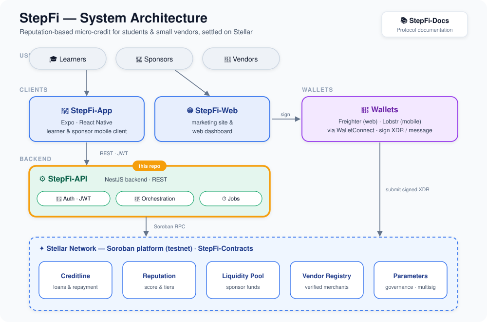

<div align="center">

# StepFi-API

**The off-chain brain of StepFi — auth, orchestration, indexing, and background jobs for reputation-based credit on Stellar.**

The NestJS backend that turns wallet signatures into sessions, builds and tracks Soroban transactions, and serves the data the StepFi clients render.

[](https://github.com/StepFi-app/StepFi-API/actions/workflows/ci.yml)
[](https://nestjs.com)
[](https://fastify.dev)
[](https://www.typescriptlang.org)
[](https://stellar.org)
[](./LICENSE)

[What it does](#-what-this-service-does) · [Where it fits](#-where-it-fits) · [Modules](#-modules) · [Quick start](#-quick-start) · [API](#-api-surface) · [Roadmap](#-roadmap)

</div>

---

## 📖 What is StepFi?

StepFi extends small, uncollateralized loans to learners and interns based on an **on-chain reputation score** rather than assets. Sponsors fund a shared liquidity pool; borrowers draw loans sized and priced by their reputation, repay in installments, and grow their score. All money and trust live in [Soroban smart contracts](https://github.com/StepFi-app/StepFi-Contracts) on Stellar — and **StepFi-API is the service that sits between the clients and those contracts.**

## 🗺️ Where it fits

<div align="center">



</div>

The clients ([StepFi-App](https://github.com/StepFi-app/StepFi-App), [StepFi-Web](https://github.com/StepFi-app/StepFi-Web)) never talk to Stellar directly. They call this REST API over wallet-signature JWT; the API authenticates them, builds Soroban transactions, submits or hands back signed XDR, indexes on-chain state, and runs the scheduled jobs that keep everything in sync.

## ⚙️ What this service does

- **Wallet-signature auth** — a challenge/nonce is signed by the user's Stellar wallet (Ed25519); a verified signature mints a JWT access + refresh pair. No passwords, no email.
- **Loan & credit orchestration** — builds request/approve/fund/repay transactions against the Creditline contract and tracks their lifecycle.
- **Reputation & credit scoring** — reads on-chain scores, caches them, and maps score → credit limit & APR.
- **Liquidity, sponsors, vendors, vouching** — endpoints backing pool deposits, merchant onboarding, and mentor vouches.
- **Indexing & jobs** — background workers (BullMQ + Redis) index chain events, refresh caches, clean up expired nonces, and reconcile transaction status.
- **Observability** — structured Pino logs, Prometheus metrics, Sentry error tracking, and a health endpoint pinged on a schedule.

## 🌐 Live deployment

| Resource | URL |
|----------|-----|
| **API base** | https://stepfi-api.onrender.com/api/v1 |
| **Swagger docs** | https://stepfi-api.onrender.com/api/v1/docs |
| **Health check** | https://stepfi-api.onrender.com/api/v1/health |

> A scheduled GitHub Action ([`health-check.yml`](.github/workflows/health-check.yml)) pings the health endpoint every 6 hours to keep the Render free-tier instance warm and acts as a heartbeat monitor — a non-200 response opens/updates a GitHub issue with the `incident` label.

<!-- CONTENT-BELOW -->

## 🧩 Modules

A NestJS application (`src/`) organized into feature modules under [`src/modules/`](src/modules), with cross-cutting `auth/`, `blockchain/`, `stellar/`, `indexer/`, `jobs/`, `database/`, `config/`, and `common/` layers.

| Module | Responsibility |
|--------|----------------|
| **auth** | Wallet-signature challenge → JWT access/refresh; passport-jwt guards |
| **users** / **learners** | Account and learner profile management |
| **loans** | Loan lifecycle — request, approve, fund, repay against Creditline |
| **credit-scoring** | Score → credit-limit & APR decisioning |
| **reputation** | On-chain reputation reads with cache |
| **liquidity** | Sponsor pool deposits, shares, withdrawals |
| **sponsors** | Sponsor onboarding and positions |
| **vendors** | Vendor registry — onboarding, catalog, payouts |
| **vouching** | Mentor vouches that boost reputation |
| **transactions** | Soroban transaction building & status tracking |
| **blockchain** | Contract clients and network wiring |
| **notifications** | User notifications |
| **metrics** | Prometheus metrics endpoint |
| **admin** | Privileged operations gated by `ADMIN_WALLETS` |
| **health** | Liveness/readiness for the scheduled heartbeat |

## 🧱 Tech stack

| Layer | Choice |
|-------|--------|
| Framework | NestJS `11` on the **Fastify** adapter |
| Language | TypeScript `5` |
| Auth | `@nestjs/jwt` + `passport-jwt`; Stellar wallet-signature challenge |
| On-chain | `stellar-sdk` (Horizon + Soroban RPC) |
| Data | Supabase (`@supabase/supabase-js`) |
| Queue / cache | BullMQ + `ioredis` (Redis), `@nestjs/cache-manager` |
| Validation | `class-validator` / `class-transformer` + `zod` |
| Hardening | `helmet`, `@nestjs/throttler` (rate limiting) |
| Observability | `nestjs-pino`, `@willsoto/nestjs-prometheus`, `@sentry/nestjs` |
| Docs | `@nestjs/swagger` (OpenAPI) |

## 🚀 Quick start

### Prerequisites

| Tool | Notes |
|------|-------|
| Node.js | ≥ 20 (matches CI) |
| npm | ≥ 10 |
| Redis | for BullMQ jobs & caching |
| Supabase project | database + storage |

### Install & run

```bash
git clone https://github.com/StepFi-app/StepFi-API.git
cd StepFi-API
npm install

cp .env.example .env      # then fill in the values below
npm run dev               # watch mode on http://localhost:<PORT>/api/v1
```

### Configuration

Copy [`.env.example`](.env.example) and set at least:

| Variable | Purpose |
|----------|---------|
| `PORT` · `API_PREFIX` · `ALLOWED_ORIGINS` | HTTP server & CORS |
| `SUPABASE_URL` · `SUPABASE_ANON_KEY` · `SUPABASE_SERVICE_ROLE_KEY` | Supabase access |
| `DATABASE_URL` | Postgres connection |
| `REDIS_URL` | BullMQ queues & cache |
| `JWT_SECRET` · `JWT_REFRESH_SECRET` | Token signing |
| `AUTH_CHALLENGE_DOMAIN` | Domain bound into the signing challenge |
| `STELLAR_NETWORK_PASSPHRASE` · `STELLAR_HORIZON_URL` · `STELLAR_SOROBAN_URL` | Stellar network |
| `CREDITLINE_CONTRACT_ID` · `REPUTATION_CONTRACT_ID` · `LIQUIDITY_POOL_CONTRACT_ID` | Deployed contract IDs |
| `SENTRY_DSN` · `SENTRY_TRACES_SAMPLE_RATE` | Error tracking (optional; no-op if unset) |

> Never commit real secrets. `.env` is git-ignored; only `.env.example` (placeholders) is tracked.

## 📜 Scripts

| Command | What it does |
|---------|--------------|
| `npm run dev` | Start in watch mode |
| `npm run build` | Compile with the Nest builder |
| `npm run start:prod` | Run the compiled server (`dist/main`) |
| `npm run lint:ci` | ESLint with `--max-warnings=0` (the CI gate) |
| `npm test` | Jest unit tests |
| `npm run test:cov` | Tests with coverage |
| `npm run test:e2e` | End-to-end tests |

## 🔌 API surface

The full, always-current contract is the **OpenAPI/Swagger UI** at [`/api/v1/docs`](https://stepfi-api.onrender.com/api/v1/docs). Endpoints are grouped by the modules above (auth, loans, reputation, liquidity, sponsors, vendors, vouching, …). See also [StepFi-Docs](https://docs.page/StepFi-app/StepFi-Docs) for protocol-level guides.

## 🛡️ Security & observability

- **Auth:** wallet-signature challenge → JWT; refresh rotation; `passport-jwt` guards. Admin routes gated by `ADMIN_WALLETS`.
- **Hardening:** `helmet` headers and `@nestjs/throttler` rate limiting on the HTTP layer.
- **Logging & metrics:** structured Pino logs and Prometheus metrics (`/metrics` via the metrics module).
- **Error tracking:** Sentry when `SENTRY_DSN` is set; silent no-op otherwise.

See [SECURITY.md](SECURITY.md) for the disclosure policy.

## 🔄 CI/CD

- [`ci.yml`](.github/workflows/ci.yml) — **required check on `main`**: `lint:ci` → `build` → `test:cov`.
- [`health-check.yml`](.github/workflows/health-check.yml) — 6-hourly heartbeat against the live health endpoint, opening an `incident` issue on failure.
- Deploys via [`render.yaml`](render.yaml) (Render).

## 🛣️ Roadmap

Development is staged from core infrastructure to a full learner-financing ecosystem — see [ROADMAP.md](ROADMAP.md) for the phase-by-phase plan (auth & profiles, reputation, loans, liquidity, vouching, notifications, and hardening).

## 🤝 Contributing

Keep `npm run lint:ci`, `npm run build`, and `npm test` green, and add tests for new behavior. See [CONTRIBUTING.md](CONTRIBUTING.md).

## 🌐 The StepFi protocol

| Repo | Role |
|------|------|
| **StepFi-API** (this repo) | Backend — auth/JWT, orchestration, indexing, jobs |
| [StepFi-Contracts](https://github.com/StepFi-app/StepFi-Contracts) | Soroban smart contracts (credit, reputation, liquidity) |
| [StepFi-App](https://github.com/StepFi-app/StepFi-App) | Learner mobile client (Expo / React Native) |
| [StepFi-Web](https://github.com/StepFi-app/StepFi-Web) | Sponsor / vendor / mentor web app |
| [StepFi-Docs](https://github.com/StepFi-app/StepFi-Docs) | Protocol documentation |

## 🏅 Contributors

<!-- LEADERBOARD_START -->
<!-- LEADERBOARD_END -->

## 📄 License

Released under the [MIT License](./LICENSE).
